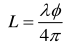

- # **赛题解析：紫光二**

## 一、背景介绍

FPGA在智能制造领域中有着广泛的应用，可以用于图像处理算法和传感器数据处理的加速，例如边缘检测、滤波、二值化、激光雷达定位等，因其并行处理能力、低延迟和硬件可定制性，是工业缺陷检测和空间定位检测的理想平台。

在工业生产中，良率是一个关键指标，所以对缺陷品、残次品进行检测是不可或缺的至关重要的一步，好的缺陷检测可以降低生产成本，减少后期返厂的损失，提供产品口碑。利用FPGA加速图像处理算法，可以提高检测效率和准确率；在空间位置检测中，FPGA可以加速传感器数据处理。如果将数据传输到计算机中进行处理，会带来很大的延迟和能耗，而使用FPGA可以实现数据的实时处理和分析，大大提高了检测的效率和准确性，所以是保障产品 质量和生产效率的关键技术。所以参赛者需基于FPGA 开发一套面向工业制造的多功能检测系统，实现缺陷识别、空间定位及自动化反馈控制。

## 二、硬件推荐

​	本次比赛参赛者选用指定紫光同创FPGA开发平台型号如下：盘古50、盘古676系列开发板、PGX-NANO、RK3568_MES2L50H，推荐使用676系列的PG2L100H板子。允许使用板载ADC、DAC、LCD、按键、LED等，可 扩展SPI/I2C等接口设备（如Flash、SD卡）。还有实现功能所需要的摄像头、

## 三、赛题要求

### 1.核心功能模块

**工业缺陷检测**：

**图像采集与预处理**：通过FPGA驱动工业相机采集产品图像，实时完成灰度化、降噪（中值滤波）、边缘增强等预处理（比赛过程中亦可以通过HDMI或其他接口作为测试输入图像，图像采集不作为评分考察内容）。

**缺陷识别算法**：针对金属表面划痕、PCB焊接缺陷等典型场景，设计基于FPGA并行计算的图像处理算法（如模板匹配、阈值分割、形态学分析），检测缺陷区域并标记；支持自定义缺陷模板，通过按键或触摸屏上传参数。

​	检测精度：缺陷最小检测尺寸低于10cm*10cm，检测准确率，检测精度越高越得分越高。

**空间位置检测**

多传感器融合定位：结合激光雷达（模拟距离测量）、红外传感器阵列等，实现工件二维或三维空间位置检测

FPGA实时处理传感器数据，计算工件坐标（X/Y/Z轴）与姿态角（俯仰/偏航/滚转），定位精度越高越好。

### 2.系统交互与反馈

人机交互界面：通过触摸屏或LCD显示检测结果、实时图像、位置坐标；支持参数设置（如检测阈值、传感器校准）。

声光报警与控制输出：

​	发现缺陷或位置偏差超限时，触发蜂鸣器与LED闪烁报警；

​	通过GPIO输出控制信号（如PLC接口协议），联动机械臂剔除缺陷品或调整设备参数。

### 3. 性能优化与FPGA优势体现

实时性：缺陷检测与位置计算总延迟越低越好，延迟越低得分越高，尽可能满足工业流水线高速检测需求。

资源定制化：利用FPGA并行处理能力，将图像算法与传感器数据处理模块硬件化加速，相比ARM平台性能提升。

扩展性：预留SPI、I2C接口，支持外接更多传感器（如压力传感器、RFID）。

**实现方案**

​	在工业生产中，有多种多样的缺陷类型，我们以就以检测金属表面划痕为例，用摄像头采集之后开始进行预处理；在缺陷识别阶段，检测出边缘部分，将特征提取出来；检测到不符合标准后，用矩形框生成器框出缺陷部分，输出到显示屏上。

​		

​	然后空间检测方面距离和像素坐标，算出空间坐标位置，将坐标与模板坐标相比较检测位置是否正确。检测出的结果通过lcd屏幕显示，用触摸屏设置检测参数（如阈值），定义output约束到LED灯和蜂鸣器控制器上，随时可以触发缺陷警报；最后比较复杂的是机械臂，只需要能做到简单的动作，把缺陷品推离工业流水线即可。下图仅供参考：

## 四、功能实现

### 		**1.工业缺陷检测** 

### **1.1图像采集**

> 用FPGA驱动工业相机采集实时图像，图像采集的方法不限，根据实际需求选择任意一种即可

采用ov5640摄像头，支持输出最大为 500万像素的图像 (2592x1944分辨率)，使用DVP接口，输出图像的数据格式支持 可以配置的YUV422、 RGB565 以及 JPEG 格式，数据量较小可以做到低延迟传输，但是色彩精度较低。

图像预处理包括灰度化，二值化，滤波，图像增强等模块，可以对输入的图像进行数据简化、噪声过滤、特征增强，输出数据量比较小、画面平滑的灰度数据存入DDR，方便缺陷识别算法更快地处理，更精准地识别，提高检测的实时性和准确性。

##### 	1.2.1 灰度化

灰度化就是把RGB转化成YUV格式，YUV(YCbCr)格式用于描述影像的饱和度和色调，Y表示亮度、U和V表示色度，可以简化图像信息、去除冗余信息、减少计算所需的数据量，提升计算效率，是所有图像处理的基础。 YCbCr 是 YUV 转换而来的，在一般情况下，两者是等价的，Y还是表示亮度、Cb表示蓝色分量、Cr表 示红色分量。 彩色灰度化有一个很著名的心理学公式，来自如下的RGB888转 YCbCr公式：

 Y  = 0.299R +0.587G + 0.114B

 Cb = 0.568(B-Y) + 128 = -0.172R-0.339G + 0.511B + 128

 Cr = 0.713(R-Y) + 128 = 0.511R-0.428G -0.083B + 128

输出灰度化图像对比原图如图所示：

​            

- **矩阵生成**

​	在数字图像处理中，部分算法需根据每个像素点及其周围一定范围内的像素点数据进行计算。在图像数据按行输入的情况下，为获取3X3 图像矩阵需同时输出三行图像中的数据，用行缓存 (Line Buffer) + 移位寄存器 (Shift Register) 的结构实现。

输出结果是

##### 	1.2.2 二值化

将图像的每个像素点的灰度值（8bit）设置为0或255，使图像呈现非黑即白的效果，如果不关注色彩以及图像的细节内容，而是关注其轮廓、边缘，或者识别某一特征，可以用二值化将数据简化。

二值化分为全局二值化和局部二值化。**全局二值化**原理是在0到255选择一个数作为阈值，局部二值化通过生成3X3 图像矩阵，对每个3x3 窗口里的灰度值数据求均值，将均值作为阈值。 

##### 	1.2.3 均值滤波

均值滤波是用像素点周围的邻域像素的平均值来代替该像素的值，其原理是使用一个窗口（如3x3 或5x5）覆盖目标像素及其邻域，计算该区域内所有像素值的均值，并用这个均值替代窗口中心像素的值，再将窗口滑动到图像的每个像素位置重复该操作。均值滤波算法简单易实现，计算量小，能够有效平滑图像和减少噪声，但同时也会导致图像细节和边缘模糊，对于需要保留边缘细节的工业检测场景尽量不选择这种方法。

##### 	1.2.4中值滤波

图像的颜色的渐变是由RGB三色搭配后线性变化显示的，如果一张图片中某一点的值异于周边的值太多，就可以判定为噪声。中值滤波算法就是取这个点的数据周围一个窗口中数值的中位数，可以帮助我们过滤图片上的椒盐噪声，适合处理孤立的噪点。

如上图所示，有3x3 的YUV图像数据矩阵，数据80 和周边的点有明显的颜色显示数值差异。反映到图像中，应该是一个比周边值更亮的噪声孤点，采用中值滤波算法，对以上原始数据矩阵进行以下处理：

首先进行排序算法，第一步是每行元素一组从大到小进行排序输出一个矩阵，

第二步对3个每行最大的、每行中间的、每行最小的元素进行排序，得到

第三步对最大的最小(右上5)，中间的中间(正中4)以及最小的最大(左下3)进行排序，取中间的值4为中值。对每个像素进行行场扫描，扫描到噪点时，该点不会输出，实现噪声滤波。滤波前后对比如下：

##### 	1.2.5 高斯滤波

高斯噪声指的是概率密度函数服从高斯分布（即正态分布）的一类噪声。如果一个噪声的幅度分布服从高斯分布，而功率谱密度又是均匀分布的，则称它为高斯白噪声。在工业场景中，由于环境温度，不良光照等等原因可能使得相机采集到的信号引入高斯噪声。二维高斯概率密度分布函数是：

高斯滤波就是通过卷积运算对整幅图像进行加权平均的过程，卷积核参考：

高斯滤波算法使噪声的影响尽可能降至最低，但是没有考虑噪声的相干性，对边缘保护不佳，容易产生黑边。

##### 1.2.6 双边滤波算法

双边滤波算法同时考虑了像素空间距离和像素相似度（周边像素与中心像素的亮度差）对权重的影响，即能有效降噪，又能保持图像边缘效果。将像素权重和空间权重相乘再代入矩阵中，形成双边滤波卷积核进行高斯滤波类似的运算即可实现。

| 滤波算法 | 优点                           | 缺点                 | 适用场景                   |
| -------- | ------------------------------ | -------------------- | -------------------------- |
| 均值滤波 | 算法简单，计算量小，快速去噪   | 模糊细节，边缘不清晰 | 背景噪声较多、边缘不敏感   |
| 中值滤波 | 对椒盐噪声效果好，边缘保护佳   | 计算较复杂           | 孤立点噪声（椒盐噪声）     |
| 高斯滤波 | 抑制高斯白噪声效果好，结果自然 | 边缘保护差，计算量大 | 光照不均、热噪声场景       |
| 双边滤波 | 降噪同时保留边缘，细节保护强   | 运算复杂，硬件成本高 | 对边缘和细节要求极高的场景 |

##### 1.2.8边缘增强

拉普拉斯算子是二阶微分算子，能对图像灰度的快速变化区域（高频部分）产生强响应，这些区域正好就是边缘，处理后可以使图像锐化。拉普拉斯算子通过卷积操作实现，卷积核是，卷积计算后边缘与原图叠加就可以增强边缘

##### 1.2.9图像增强

直方图均衡化是常见的图像增强方法，可以让图像的灰度尽可能均衡分布，对比度更高，使金属表面的弱划痕在背景里更容易显现。

工业检测中由于光照的影响，没有缺陷的工件表面也会出现局部亮度的不同，容易导致误判，为了降低图像局部的阴影和光照变化，需要对整个图像进行伽马校正，将图像整体亮度提高或降低。

下面是不同gamma值的输出对比

### 1.3缺陷识别算法：

> 针对金属表面划痕、PCB焊接缺陷等典型场景，设计基于FPGA 并行计算的图像处理算法（如模板匹配、阈值分割、形态学分析），检测缺陷区域并标记；支持自定义缺陷模板，通过按键或触摸屏上传参数。检测精度：缺陷最小检测尺寸低于10cm*10cm，越小精度越高，检测精度和准确率是主要指标。

##### 1.3.1阈值分割

采用大津算法（即Otsu算法）进行阈值分割，根据图像的灰度分布直方图，通过最大化类间方差来自动选择合适的阈值，将背景与缺陷区域分开。 可以根据预设的缺陷大小和形状特征进一步优化阈值设置。确认阈值后可以进行二值化或者特征提取。

阈值T将像素颜色值分成两类，小于等于阈值属于前景色的概率为p1，大于属于背景色的概率为p2，颜色均值分别为m1、m2，所有像素均值为mG，类间方差为找到一个灰度值或梯度值m使得这个方差最大，即为阈值T。

注：当目标与背景的面积相差不大时，能够有效地对图像进行分割；目标与背景的面积相差很大时，表现为直方图没有明显的双峰，分割效果不佳，或者目标与背景的灰度有较大的重叠时也不能准确的将目标与背景分开

##### 1.3.2边沿检测

图像处理中的边缘检测计算一般使用sobel算子，在灰度化的基础上进行检测，同时边缘检测对噪声也及其敏感，需要先经过高斯滤波降噪。sobel算子是一个离散的一阶差分算子，其原理就是基于图像的卷积来实现在水平方向与垂直方向检测。

Canny边缘检测是工业视觉中是sobel升级版，其实是在sobel的基础上进行非极大值抑制和双阈值检测，描绘出更精准的边缘。

##### 1.3.3形态学分析

形态学分析是基于集合论的图像处理方法，包括腐蚀、膨胀、开运算和闭运算等操作，腐蚀膨胀是针对二值化图像来处理的，腐蚀的作用是可以消除一些毛边或者孤立的噪点，让图像在某些边界变得平滑；

膨胀的作用是填充某些空洞，连接断裂划痕，使某些部分向外扩张以达到连接边界等作用；

腐蚀膨胀的综合用法是开运算和闭运算，开运算（先腐蚀后膨胀）用于去除图像中的噪声点和小的突出部分，闭运算（先膨胀后腐蚀）用于填充小孔和填补物体边缘的小缺口。在缺陷检测中，形态学处理可用于对阈值分割或边缘检测后的结果进行优化，去除一些伪缺陷或修复缺陷区域的不完整边界。

然而这个方法也会造成诸如过度腐蚀膨胀的问题，如果引入一个阈值，计算矩阵内像素值之和大于阈值时才进行腐蚀膨胀操作，腐蚀膨胀的强度就可以调节。

##### 1.3.4模板匹配

模板匹配算法的核心是计算图像块和标准模板之间的相似度，使用特征向量匹配或者常见的相关系数或均方误差来衡量，相似度越高就越接近标准模板，反之就是缺陷。其算法精度比较高，适合检测固定姿态固定位置下，已知形状的不规则的表面缺陷或者物体几何形状缺陷，比如使用模具制作出来的零件，PCB焊点检测，印刷的文字等。但对模板以外的形状或者旋转和缩放过的缺陷不敏感，容易漏检。

有以下进行几种方式：**归一化互相关法**，**最小误差法**，**特征向量匹配**法

##### 1.3.5梯度直方图统计

**颜色直方图**能快速描述图像整体像素值分布的统计信息，显示出某一像素值范围的像素点的个数，适用于有颜色差异的色块类型缺陷。其算法简单快速，不需要过多处理，抗噪声能力强，但是只能反映全局颜色分布，无法描述图像的局部特征，精度较差。

对于形状、位置随机，方向不固定的缺陷类型，比如金属划痕缺陷，**梯度方向直方图统计**（HOG）能够很好地提取图像中的局部形状和纹理特征，能够捕捉到较复杂的缺陷类型，适合那些形态变化较多的缺陷。然而，HOG计算量比颜色直方图大，对旋转和尺度变化较为敏感。

各种缺陷识别算法的比较

| 检测算法   | 适用场景                                    | 优点                           | 缺点                                       |
| :--------- | :------------------------------------------ | :----------------------------- | :----------------------------------------- |
| 模板匹配   | 标准化零件，几何形状、位置异常，PCB焊点检测 | 实现简单，直观，对固定模板有效 | 随机缺陷不适合，对缩放和旋转不能识别       |
| 颜色直方图 | 检测涂层均匀、印刷色差                      | 简单快速，计算代价低，抗噪声   | 只能反映全局颜色分布，精度差，光照影响严重 |
| 梯度直方图 | 划痕、裂纹等线状或纹理类缺陷                | 可以检测方向性缺陷             | 计算量比较大，光照变化敏感                 |

**检测精度**

>检测精度：缺陷最小检测尺寸低于10cm*10cm，检测准确率，检测精度越高越得分越高。

要提高准确率和检测精度,有多种方法：
	在图像采集阶段可以采用更高清晰度。
	预处理阶段采用更好的算法来降噪,双边滤波可以在降噪的同时保留边缘细节,然后使用拉普拉斯算子进行边缘增强,使用伽马校正算法进行图像锐化,使缺陷更加突出。
	在特征提取和匹配方面,增加多尺度检测,在不同尺度下提取特征，检测不同大小的缺陷；进行检测时可以将图像分为若干个小块,进行局部检测,增加精度。
	在缺陷识别算法方面使用canny算子进行边缘检测，输出更高精确的边缘数据；或者直接加入机器学习:引入简单的分类器（如SVM或决策树）对特征进行分类，提高复杂场景下的检测能力。
	在数据方面可以通过增加正常模板的多样性，减少误检;通过旋转、缩放、翻转等方式生成更多缺陷样本，提升算法的鲁棒性。
	通过人机交互界面实时监视检测结果,支持手动调整检测参数，确保检测精度。

### **1.4空间位置检测**

**1）多传感器融合定位**：

> 结合激光雷达（模拟距离测量）、红外传感器阵列等，实现工件二维或三维空间位置检测

激光雷达测距常用的方法有三角法测距、脉冲测距和相位测距。三角法在近距离精度最高，适合距离较近的检测，但是基本无抗干扰能力，只要有一点角度偏移，对测量结果的影响就很大

| 方法     | 距离 | 精度   | 抗噪声能力 | 激光功率 | 成本 |
| -------- | ---- | ------ | ---------- | -------- | ---- |
| 三角法   | 近   | 近处高 | 无         | 低       | 低   |
| 脉冲测距 | 远   | 低     | 强         | 中       | 高   |
| 相位测距 | 中等 | 高     | 中等       | 较高     | 中等 |

**三角法测距**

三角测距激光雷达是通过摄像头的光斑成像位置来，距离L = f(L+x)/x

**脉冲测距**

脉冲测距是最简单的方法，根据激光发射到目标表面反射回来的时间，即可根据光速计算出距离，距离公式为L=ct/2。适用于中远距离测量。

**相位测距**

相位测距法就是将激光通过信号调制发射出去，根据接收信号和发射信号之间的相位差来计算距离，精度可达到毫米微米级别，适合中短距离的测量。其计算公式是，不用测量时间和频率，只需要知道波长和相位差就可以得出距离。

测试工件的二维坐标时，将摄像头正对准工件，根据边缘像素位置得出XY轴的像素坐标值，然后用距离和相机参数计算出空间坐标。

##### 双目测距法

双目法测距的原理就是通过两路相机图像的**视差**来反推出景物的深度值，类似于三角测距法。在左右图像中寻找同一物体的对应点，计算视差即左相机和右相机成像点的水平位置差。然后可以结合焦距、像素差和双目相机基线长度计算出距离。

**红外传感阵列**

​	红外传感阵列由多个红外发射器 加接收器组成的线性阵列或二维矩阵，每个探测器对应一个空间采样点；其工作原理是：当物体进入阵列检测范围时，会遮挡住发射的红外线，改变某些点的探测器接受的红外信号强度，就可以识别出物体位置。
​	多传感器融合的好处，就是用不同传感器互相补充，避免单一传感器带来的盲区和误差，从而保证定位的精度和稳定性，所以在工业检测中，红外阵列就常作为粗略定位的手段，先快速确定物体大致位置，再用高分辨率相机做精细检测得到像素坐标。

**2）**传感器数据处理

> FPGA实时处理传感器数据，计算工件坐标（X/Y/Z轴）与姿态角（俯仰/偏航/滚转），定位精度越高越好

像素坐标和世界坐标的关系如下图所示：

传感器坐标计算中，内参是描述相机内部属性的参数，包括焦距、主点坐标、畸变系数等，外参主要描述传感器坐标系与世界坐标系之间的空间位置和姿态关系。

想要将特征点像素坐标转化为空间坐标，要先求出相机内部参数，为外参矩阵，R为旋转矩阵，用姿态角计算，t为平移矢量。

姿态角测算用IMU来实现，即惯性测量单元，xyz轴分别对应roll、pitch、yaw三个旋转角：

最后逆推得出世界坐标

## 2 系统交互与反馈

### 2.1人机交互界面

> 通过触摸屏或LCD显示检测结果、实时图像、位置坐标；支持参数设置（如检测阈值、传感器校准）。

通过文字显示模块显示结果和矩形框生成模块标记出缺陷，触摸屏上输入阈值写入寄存器，触摸屏常见 的有电阻屏（使用AD转换器），电容屏（使用I2C接口），或者使用树莓派作为上位机。

### 2.2声光报警

> 发现缺陷或位置偏差超限时，触发蜂鸣器与LED闪烁报警

​	每当检测到缺陷时，或者待测工件的坐标偏离了标准坐标一定的阈值，输出一个使能信号给LED和蜂鸣器

### 2.3 GPIO控制输出

> 通过GPIO输出控制信号（如PLC接口协议），联动机械臂剔除缺陷品或调整设备参数。.

​	检测到缺陷时，根据检测到的空间坐标锁定工件，输出机械臂控制信号把缺陷品推离。

机械臂不需要太多的自由度，只要能完成简单的推拉的动作即可；

一般在步进伺服控制里，PLC 协议使用脉冲频率来控制电机输出功率改变转速，用脉冲数量来控制伺服电机旋转的总圈数，以此控制机械臂旋转的角度，通过运动学解算，产生控制信号。

**实时性**：缺陷检测与位置计算总延迟越低越好，延迟越低得分越高，尽可能满足工业流水线高速检测需求。
为了提升实时性,选择合理的时钟频率，使用流水线结构优化关键路径，提高实时性；可以多使用BRAM缓存数据，避免DDR频繁访问。

**资源定制化**：利用FPGA并行处理能力，将图像算法与传感器数据处理模块硬件化加速，相比ARM平台性能提升。

采取多路例化并行的计算，并且类似方向量化的反切运算这种复杂的运算，尽量用LUT查找表来替代，梯度幅值的开方运算运用绝对值近似。相比软件实现，FPGA可将处理延迟从毫秒级降至微秒级，加速倍数达10-100倍，尤其在边缘计算的高速流水线中体现优势。

**扩展性**：预留SPI、I2C接口，支持外接更多传感器（如压力传感器、RFID）

I2C接口用于配置ov5640寄存器

参考资料

[基于fpga的灰度图像模板匹配并行处理分析-计算机应用技术专业论文.docx 全文免费](https://max.book118.com/html/2019/0110/8105100140002000.shtm)

[(PDF) Scratch Detector - A FPGA Based System for Scratch Detection in Industrial Picture Development.](https://www.researchgate.net/publication/221188895_Scratch_Detector_-_A_FPGA_Based_System_for_Scratch_Detection_in_Industrial_Picture_Development)

[A new lightweight deep neural network for surface scratch detection | The International Journal of Advanced Manufacturing Technology](https://link.springer.com/article/10.1007/s00170-022-10335-8?utm_source=chatgpt.com)

［1］李亮,李栋．一种基于FPGA的实时直方图均衡化的方法[J]．自动化应用,2015,000(10):21-23,35

[OTSU算法（大津法—最大类间方差法）原理及实现-CSDN博客](https://blog.csdn.net/weixin_40647819/article/details/90179953)

[图像分割——采用梯度算法改善全局阈值设定 - 代码先锋网](https://www.codeleading.com/article/62362083223/)

图像实验指导手册_盘古676系列100Pro+开发板教程3

[【紫光同创FPGA图像视频教程】【基于盘古676开发板】哔哩哔哩_bilibili](https://www.bilibili.com/video/BV1wYo9YgEJe?spm_id_from=333.788.videopod.sections&vd_source=13c8ce0d9f9b2bcd1effd391a04d4dba)

[1]陈明明,祝永新,田犁,等.基于FPGA的双目实时测距算法设计[J].微电子学与计算机, 2018, 35(10):5.DOI:CNKI:SUN:WXYJ.0.2018-10-013.

[基于fpga实时处理的双目测距系统.pdf-原创力文档](https://max.book118.com/html/2023/0314/6000234143005101.shtm?from=search&index=2)

[ 坐标转换：从图像坐标到世界坐标的旅程 - 知乎](https://zhuanlan.zhihu.com/p/666365279)

[FPGA图像处理基础----直方图均衡化_fpga直方图均衡化-CSDN博客](https://blog.csdn.net/qq_41332806/article/details/107213173)

[【紫光同创FPGA图像视频教程】【基于盘古676开发板】字符叠加代码讲解_哔哩哔哩_bilibili](https://www.bilibili.com/video/BV1cCZnY7E5J/?spm_id_from=333.1387.upload.video_card.click)

[逻辑派Z1开发板视频教程第一期_哔哩哔哩_bilibili](https://www.bilibili.com/video/BV16PQPY7EAr/?spm_id_from=333.1387.upload.video_card.click)

[多目标多角度的快速模板匹配算法（基于NCC，效果无限接近Halcon)_金字塔下采样初步确定模板匹配角度范围-CSDN博客](https://blog.csdn.net/weixin_39450742/article/details/118600464)

[应用灰度直方图特征识别木材表面节子缺陷](https://www.researching.cn/ArticlePdf/m00002/2015/52/3/031501.pdf)

